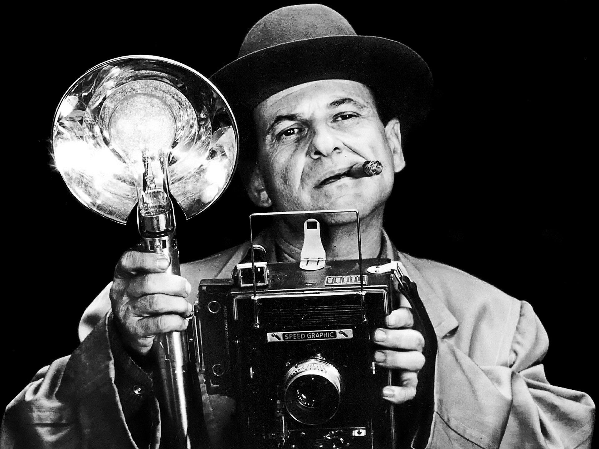
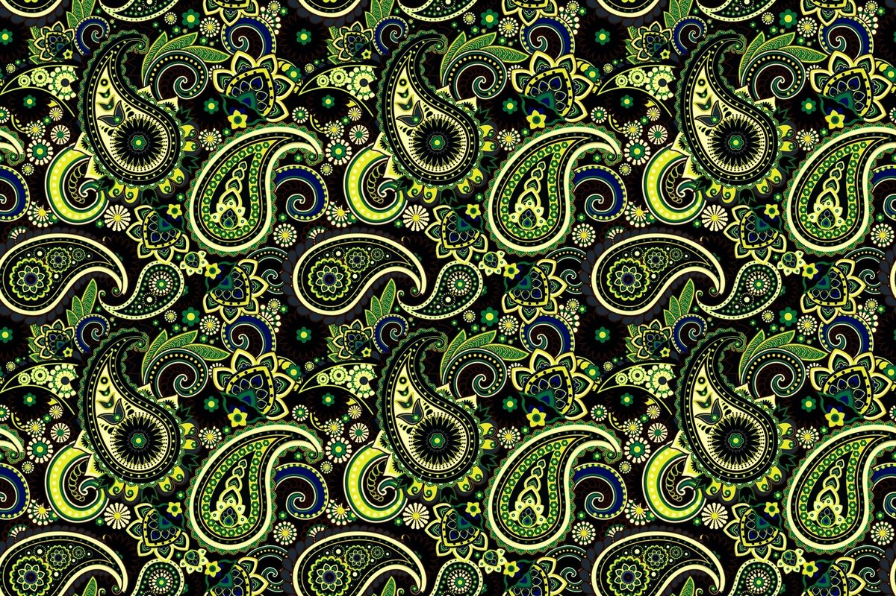
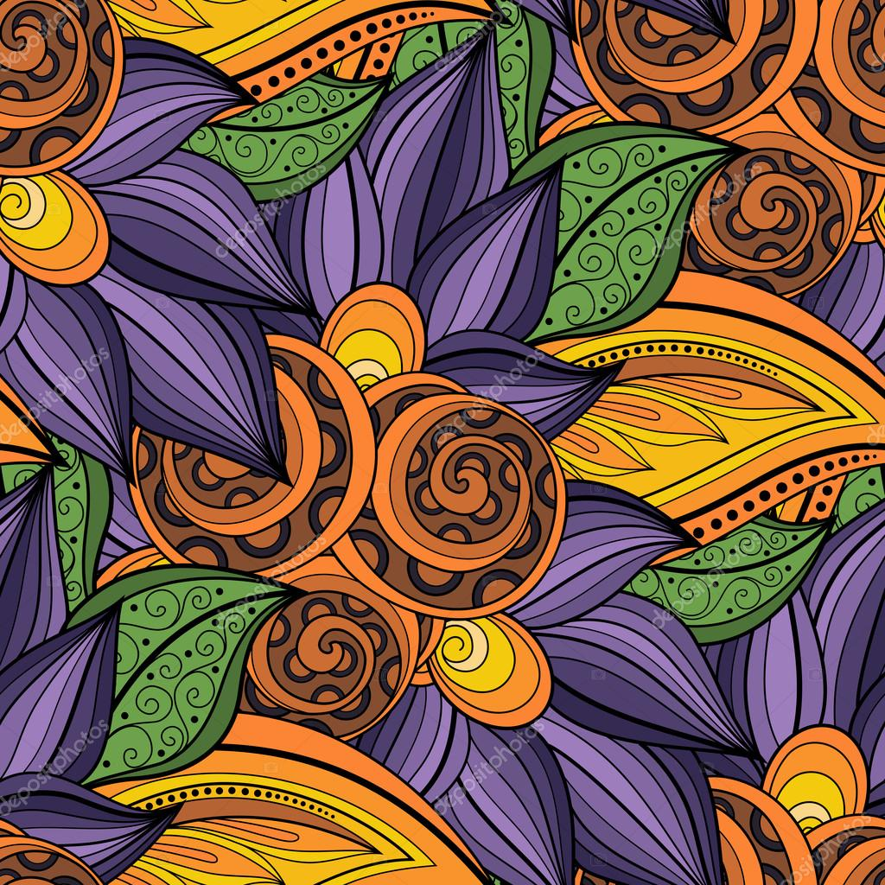
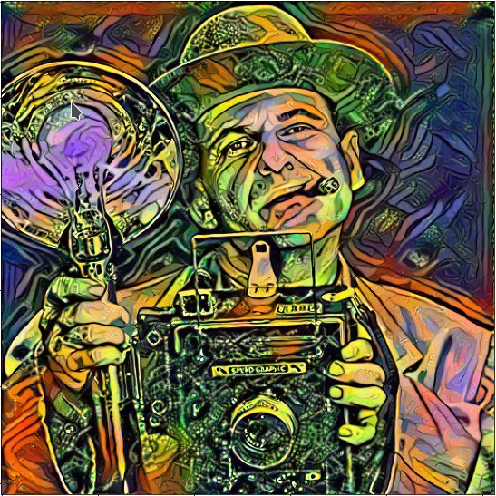
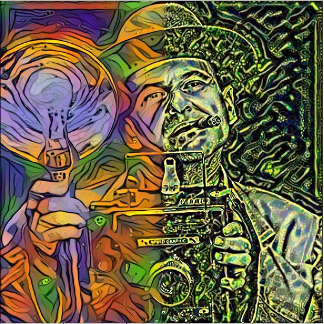

# Реализация Neyral Style Transfer на библиотеке Pytorch

В данном ноутбуке приведено 2 варианта реализации нейронного переноса стиля
1. Посредством одновременного применения двух стилей ко всему входному изображению
2. Посредством одновременного применения двух стилей на две половины входного изображения. На каждую половину свой стиль.

## Исходное изображение 

## Файлы стилей

### Стиль 1

### Стиль 2

## Результат

### Cмешивание

### Разделение

